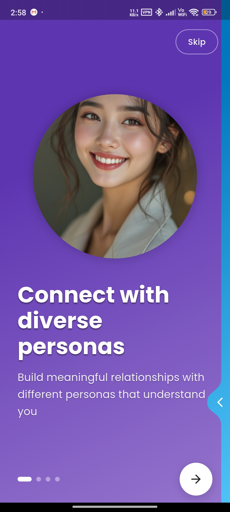
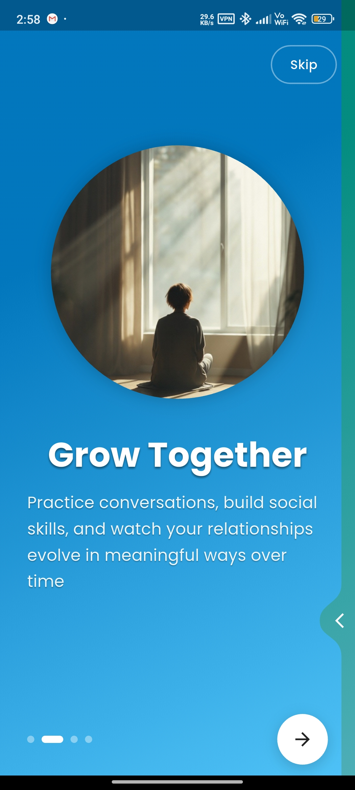
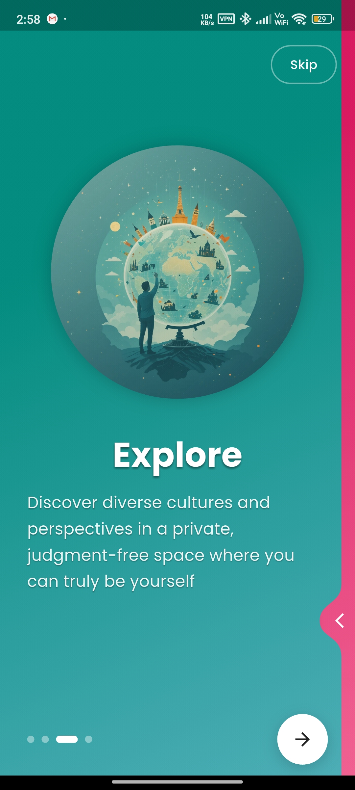
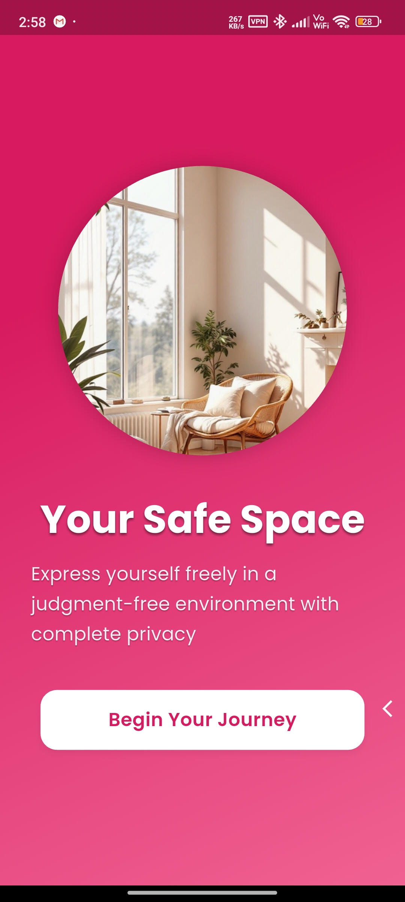
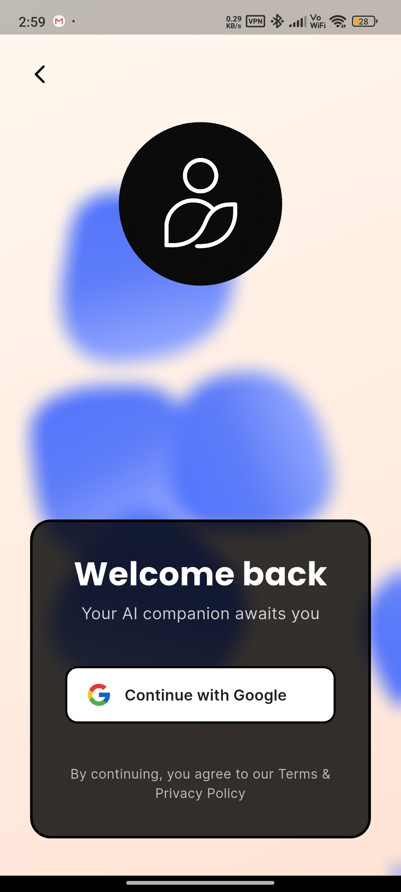

# AI Companion Flutter App – Comprehensive Project Documentation

## Project Overview & Vision

**Purpose & Vision:**  
AI Companion is a mobile app that provides users with a personalized, emotionally intelligent AI companion for meaningful conversations, emotional support, and self-expression. It targets users seeking companionship, support, or conversational practice, and aims to foster authentic, human-like interactions in a safe, engaging space.

**Main Goals:**
- Deliver authentic, human-like AI conversations.
- Support onboarding, profile management, and personalization.
- Enable selection/customization of unique AI companions.
- Ensure privacy, security, and seamless cross-platform experience.

**Problems Solved:**
- Alleviates loneliness and provides emotional support.
- Offers a safe, judgment-free conversational partner.
- Helps users practice social skills and self-expression.

---

## Implementation Details

### Architecture & Design Patterns
- **Layered Architecture:** Presentation (Flutter UI), Business Logic (Bloc), Data (Repositories/Services).
- **Bloc Pattern:** State management for authentication, chat, and companion selection.
- **Repository Pattern:** Abstracts data access and business logic.
- **Service Layer:** Integrations (Supabase, Hive, AI APIs, connectivity, image caching).
- **Separation of Concerns:** Isolated modules for maintainability.

### Folder Structure & Roles
- `lib/AI/` – AI logic and models.
- `lib/auth/` – Authentication logic and providers.
- `lib/chat/` – Chat logic, message models, conversation/session management, message fragmentation, Bloc for chat state.
- `lib/Companion/` – AI companion models, repository, Bloc for companion state.
- `lib/Documentation/` – In-depth technical documentation and analysis.
- `lib/ErrorHandling/` – Error handling utilities and exception classes.
- `lib/navigation/` – App routing and navigation logic.
- `lib/services/` – Core services (caching, connectivity, image handling).
- `lib/themes/` – App theming and styling.
- `lib/utilities/` – Helper widgets, constants, dialogs, and loading screens.
- `lib/Views/` – UI screens and components for onboarding, chat, home, profile, etc.
- `assets/` – Images, animations, fonts, icons.
- `test/` – Unit and widget tests.

---

## Tech Stack

### Major Technologies & Libraries
- **Flutter & Dart:** Core framework for cross-platform mobile development.
- **Supabase:** Backend for authentication, database, and storage.
- **Hive:** Local NoSQL storage for offline data and caching.
- **Google Generative AI (Gemini):** AI conversational responses.
- **Bloc:** State management (flutter_bloc).
- **GoRouter:** Navigation.
- **Shared Preferences:** Lightweight key-value storage.
- **Lottie, Shimmer, CachedNetworkImage:** UI/UX enhancements.
- **Connectivity Plus:** Network status monitoring.
- **Flutter Cache Manager:** Image/file caching.
- **Other:** Equatable, RxDart, intl, photo_view, etc.

### Integration & Purpose
- **Supabase:** Auth, profile storage, real-time sync.
- **Gemini AI:** Human-like responses.
- **Bloc:** State transitions and event handling.
- **GoRouter:** Navigation.

---

## System Integration

### Module Interactions
- **Authentication:** Managed by Bloc and Supabase provider; user data is shared with other modules.
- **Chat:** Handles message flow, caching, AI invocation; integrates with Gemini AI and Hive.
- **AI/Companion:** Manages AI personas and selection.
- **Navigation:** GoRouter for state-driven navigation.
- **Services:** Connectivity, image caching, loading overlays.

### Data & Control Flow
1. App launches, checks auth state.
2. If unauthenticated, shows onboarding/sign-in.
3. On login, loads user profile.
4. User selects AI companion.
5. User sends message; AI responds; messages cached.
6. Navigation between screens via GoRouter.

---

## Feature & Flow Documentation

### 1. User Authentication & Onboarding
- **Files:** `auth_bloc.dart`, `auth_event.dart`, `auth_state.dart`, `supabase_authProvider.dart`, `sign_page.dart`, `onboarding_screen.dart`
- **Flow:** App checks auth state → onboarding/sign-in → login → user data fetched → navigation to home/onboarding.

### 2. Message Flow (User Input → AI Response → Display)
- **Files:** `chat_repository.dart`, `message_bloc.dart`, `message_event.dart`, `message_state.dart`, `gemini_service.dart`, `conversation_bloc.dart`, `chat_input_field.dart`, `chat_page.dart`
- **Flow:** User inputs message → Bloc processes → message fragmented → sent to Gemini AI → response fragmented → UI updates → messages cached.

### 3. AI Flow (Invocation & Response Handling)
- **Files:** `gemini_service.dart`, `companion_state.dart`, `ai_model.dart`
- **Flow:** Message event triggers Gemini AI → response generated → processed and returned to chat → companion state updated.

### 4. Navigation Flow
- **Files:** `app_routes.dart`, `routes_name.dart`, `home_screen.dart`, `chat_page.dart`, `user_profile_screen.dart`, `companion_selection.dart`
- **Flow:** GoRouter manages navigation; Bloc state changes trigger route transitions.

---

## Component Implementation & Actions

### 1. Authentication
- **Responsibilities:** Sign-in, sign-up, Google login, session management.
- **Key Classes:** `AuthBloc`, `SupabaseAuthProvider`, `CustomAuthUser`.
- **Communication:** Emits auth state changes to UI and other Blocs.

### 2. Chat & Messaging
- **Responsibilities:** Message sending, AI invocation, caching.
- **Key Classes:** `MessageBloc`, `ChatRepository`, `GeminiService`, `Message`, `Conversation`.
- **Communication:** Listens to user input, updates UI, interacts with AI and storage.

### 3. AI Companion
- **Responsibilities:** Defines personas, manages selection.
- **Key Classes:** `AICompanion`, `CompanionBloc`, `CompanionRepository`.
- **Communication:** Loads/syncs data, provides context for chat.

### 4. Navigation
- **Responsibilities:** Route transitions, deep linking.
- **Key Classes:** `GoRouter`, `RoutesName`, `AppRoutes`.
- **Communication:** Responds to Bloc state and user actions.

### 5. Services
- **Responsibilities:** Local storage, connectivity, image caching, loading overlays.
- **Key Classes:** `HiveService`, `ConnectivityService`, `CompanionImageCacheManager`, `LoadingScreen`.
- **Communication:** Shared utilities for all modules.

---

## Best Practices & Extensibility

- **State Management:** Bloc for predictable, testable transitions.
- **Error Handling:** Custom exceptions and translators.
- **Testing:** Unit tests for core logic.
- **Separation of Concerns:** Clear boundaries between layers.
- **Offline Support:** Hive and SharedPreferences.
- **Extensibility:**  
  - Add new companions via `ai_model.dart` and Supabase.
  - Integrate new AI/ML APIs via `gemini_service.dart`.
  - Add screens/flows via GoRouter and Bloc.
  - Modular structure for easy feature addition.

---

## Summary

The AI Companion app combines modern Flutter architecture, robust state management, and advanced AI integration to deliver a unique, emotionally intelligent conversational experience. Its modular, extensible design ensures maintainability and future growth.

---

**See the lib directory and referenced files/classes for more details.**
# AI Companion

*Connect, converse, and build relationships with AI companions that feel genuinely human.*

## Overview

AI Companion is a Flutter application that enables users to build meaningful relationships with AI-powered companions, each with their own distinct personalities, backgrounds, and communication styles. Whether you're seeking friendship, emotional connection, or simply a space to practice conversation skills, our AI companions provide authentic and engaging interactions.

## Vision

AI Companion offers a unique platform where users can:

- **Build Meaningful Connections**: Develop companionship, friendship, or even emotional and intimate connections with companions that feel real.
- **Practice Communication Skills**: Improve language fluency, build social confidence, and develop conversational abilities in a judgment-free environment.
- **Explore Diverse Personalities**: Interact with companions representing different backgrounds, cultures, personalities, and communication styles.
- **Experience Seamless Conversations**: Chat anytime, anywhere - with our robust synchronization system.
- **Watch Relationships Evolve**: See how your relationship with companions changes over time based on your interactions.

## Key Features

- **Diverse AI Companions**: Each with unique backstories, personalities, interests, and communication styles
- **Relationship Development**: Companions remember past conversations and build an evolving relationship with users
- **Conversation Synchronization**: Seamlessly transition between online and offline usage
- **Personalized Interactions**: Adaptive responses that reflect your unique relationship with each companion
- **Multiple Conversation Threads**: Maintain separate conversations with different companions
- **Emotional Expression**: Companions display emotions and react to your messages based on their personality
- **Cultural Exploration**: Learn about different cultures through companions with diverse backgrounds
- **Privacy-Focused**: Your conversations remain private and secure

## Application Screenshots

### Onboarding & Authentication

  
  
  
  
  
  

### Home Screen & Navigation
View your conversations, pin favorites, and explore a well-designed navigation experience.

  

### Companion Selection
Discover a diverse range of AI companions, each with unique personalities and characteristics.

  
  

### Chat Experience
Engage in natural conversations with emotional expression and relationship development.

  
  

### User Profile & Settings
Customize your experience and manage your personal information.

  

## Technical Stack

- **Frontend**: Flutter for cross-platform mobile experience
- **Backend**: Supabase for authentication, data storage, and real-time features
- **AI**: Google's Gemini AI for natural language processing and conversation generation
- **State Management**: BLoC pattern for efficient state management
- **Data Caching**: Hybrid caching system(Hive + shared preference) for offline support 
- **Authentication**: Secure authentication through Google

## Caching

AI Companion features a robust Caching and offline system that:

- Caches conversation history for seamless offline viewing
- Caches and Stores companion data locally for access without internet
- Queues messages sent while offline and sends them when connectivity is restored
- Synchronizes conversations between device and server automatically
- Provides visual indicators for pending messages

## Project Structure

The project follows a structured architecture:

- `lib/Companion/`: AI companion models and logic
- `lib/auth/`: Authentication management
- `lib/chat/`: Chat functionality including message handling and offline support
- `lib/Views/`: UI screens and components
- `lib/utilities/`: Helper functions and widgets
- `lib/services/`: Core services like caching and API communication
- `lib/themes/`: App styling and theming

## Acknowledgements

- Google Gemini AI for powering our conversation engine
- Supabase for backend infrastructure
- Flutter and Dart teams for the development framework
